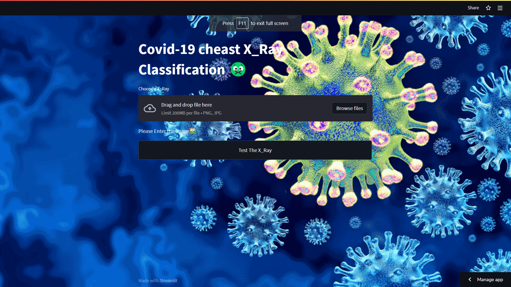

# 🦠 COVID-19 X-Ray Image Classification (End-to-End)


<div align="center">
  
  <p><em>A glimpse of the web application's user interface.</em></p>
</div>


[](https://www.python.org/)
[](https://streamlit.io/)

This project provides an **end-to-end solution** for classifying **COVID-19** from chest X-ray images using a **Convolutional Neural Network (CNN)** model. It includes a trained deep learning model and a user-friendly **Streamlit web application** for easy deployment and real-time predictions.

---

## 🚀 Deployed Application

Try out the **live application** here:  
🔗 [COVID-19 Chest X-ray Classifier App](https://uvais5-covid-19-x-ray-image-classification-end-to-en-app-ma1soe.streamlitapp.com/)

---

## 📖 Medium Article

For a detailed explanation of the project, CNN architecture, training process, and deployment, refer to the accompanying article:  
📘 *COVID-19 Chest X-Ray Image Classification CNN End-to-End with Streamlit Deploy*  
(*[Add Medium article link if available]*)

---

## 🎬 Project Demo

<div align="center">
  <a href="https://www.youtube.com/watch?v=1965Aa28cyQ" target="_blank">
    
  </a>
  <br>
  <strong><a href="http://www.youtube.com/watch?v=XKYLPc-wEyc" target="_blank">▶️ Watch: Build a Covide-19 Xray-classification System</a></strong>
  <p>Video by Data Science Solutions</p>
</div>


*Chest X-Ray Covid-19 Detection | Transfer Learning | Deep Learning | Kaggle | TensorFlow | Python*

---

## ✨ Features

- ✅ **Image Classification**: Predicts COVID-19 status from chest X-ray images  
- 🧠 **Deep Learning**: Utilizes a Convolutional Neural Network (CNN)  
- 🌐 **Streamlit Web App**: Clean interface for uploading images and viewing predictions  
- 🧰 **End-to-End Pipeline**: From preprocessing and training to live deployment

---

## 🛠️ Installation

### 1. Clone the repository

```bash
git clone https://github.com/Uvais5/Covid-19_X_Ray_Image_Classification_end_to_end.git
cd Covid-19_X_Ray_Image_Classification_end_to_end
```

### 2. Install dependencies
``` bash
  pip install -r requirements.txt
  pip install tensorflow keras streamlit opencv-python numpy
```
### Usage
```bash
   streamlit run app.py
```
